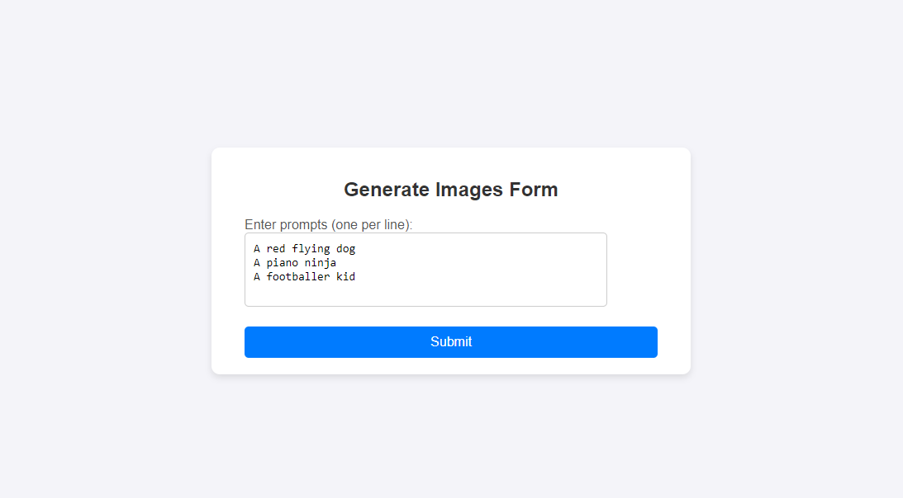
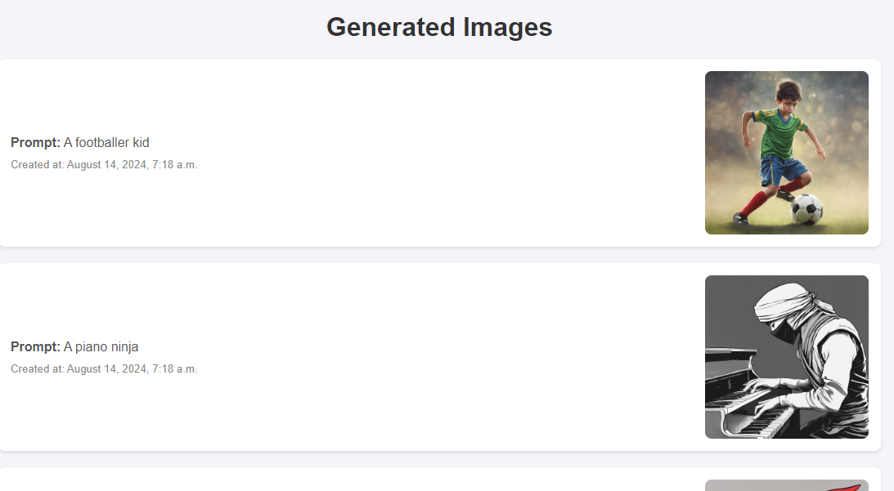
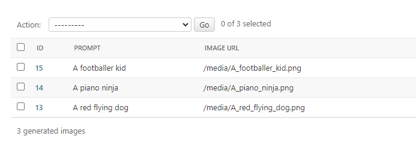

# ChaotixAI
**Project Description:** Project Description: ChaotixAI is an image generation application powered by Stability AI. The application allows users to generate images using text prompts and leverages Django, Django REST Framework, and Celery for parallel processing.

## Table of Contents

- [Project Overview](#project-overview)
- [Getting Started](#getting-started)
  - [Prerequisites](#prerequisites)
  - [Installation](#installation)
- [Usage](#usage)
- [Configuration](#configuration)

## Project Overview
ChaotixAI provides an interface for users to generate images from text prompts. The project is built using Django for the backend, Django REST Framework for API management, and Celery for handling image generation tasks in parallel. This ensures efficient processing and scalability.


## Screenshots

### Prompts input form


### Image Generation Interface


### Admin Dashboard



### Usage
ChaotixAI provides a user-friendly interface for generating images based on text prompts. You can interact with the application via the frontend or through API endpoints provided by the Django REST Framework.

## Getting Started

To get started with ChaotixAI, follow the steps below to set up the development environment and run the application locally.

## Prerequisites

Before you begin, ensure you have the following installed:

- Python (version 3.9)
- Django (version 4.2.15)
- Django REST Framework (version 3.15.2)
- Celery (for task management)
- Redis (as a message broker for Celery)


### Configuration
- Environment Variables: Make sure to configure your environment variables, such as API keys for Stability AI, Redis settings for Celery, and database configurations.
- Settings: The project settings can be modified in the settings.py file. You may need to adjust the configurations based on your deployment environment.

### URLs for Image Generation/Listing
 - For generating images: http://127.0.0.1:8000/image-generator/generate-images/
 - For listing generated images: http://127.0.0.1:8000/image-generator/list-images/

### APIs for Image Generation
 - API to generate images: http://127.0.0.1:8000/image-generator/generate/
 - Stability AI API used to generate images: https://api.stability.ai/v1/generation/stable-diffusion-xl-1024-v1-0/text-to-image
### Installation


```bash
# Clone the repository
git clone https://github.com/JaspreetSingh19/ChaotixAI.git

# Change directory to the project folder
cd ChaotixAI

# Create a virtual environment (optional but recommended)
python -m venv venv

# Activate the virtual environment
# On Windows
venv\Scripts\activate
# On macOS and Linux
source venv/bin/activate
# For Pycharm
Add New Interpreter >

# Install project dependencies
pip install -r requirements.txt

# Run migrations
python manage.py migrate

# Create superuser
python manage.py createsuperuser

# Start the development server
python manage.py runserver

# Start celery
celery -A chaotixai worker --loglevel=info